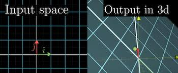

<h1>Linear Algebra</h1>

## Table of Contents

1. [Vectors](#vectors)
 

## 1. Vectors 

 Defined as ordered list of numbers or, 
 Quantity having both magnitude and direction 
 [13,4]=[x,y]

 Scaling of vectors: Multiplying a constant(scalar) with a vector  
    2[1,2] = [2,4]

<h2> 2. Linear Combinations, Span and Basis Vectors </h2>

 $\vec{v}$= i + 2j = [1,2], where i and j are unit basis vectors 
    Linear combination: $a\vec{v}+ b\vec{w}$ 
    It basically represents the span of the vectors, when taken as basis vectors 
    For 2 vectors: It is a plane    For 3 vectors: It can represent all vectors 
    Linearly dependent: $\vec{u} = a\vec{v}+ b\vec{w}$  
    Linearly independent: $\vec{u} \neq a\vec{v}+ b\vec{w}$ 
    Basis of vector space is a set of Linearly independent vectors that span the full space

## 3. Linear Transformations

 Transformations are basically functions that change the landing direction of the input vector 
 Linear transformations are those in which the lines remain lines and the origin remains fixed. The axes gridlines remain parallel and evenly spaced. 
 We only have to consider where the basis vectors $\hat{i}$ and $\hat{j}$ land after the transformation 
 <figure><figcaption>image caption</figcaption></figure>
 Transformations having linearly dependent vectors lead to limiting of the span to 1-D (a line). 
 Linearity have following characteristics : 
 1. Additivity: $L(\vec{v} + \vec{w}) = L(\vec{v}) + L(\vec{w})$  
 2. Scalability: $L(c \vec{v}) = cL(\vec{v})$
 

## 4. Matrix multiplication as composition

 Composition is applying two transformations in steps. Product of two transformation matrices gives the composition matrix.  
  
 Order of multiplying matrices is not commutative, it leads to different landing points. 
 

 
## 5. Determinant

 Determinant of a transformation matrix is the scaling factor for the area/volume of a space/region. Its -ve/+ve sign refers to the flipping of the space. 
  
 Flipping refers to whether or not the basis vectors $\hat{i}$ and $\hat{j}$ change their relative orientation. In 3-D, it means that the relative 
 positions of the axes change in orientation. First, they can be represented by right-hand rule, and then by left-hand.  
 When determinant is zero, it implies the area scales down to nothing.
 
 

 
 ## 6. Inverse of a Matrix
 
 

 Inverse transformation matrix is the process of nullifying the said matrix to get the original vector back. 
 $A\vec{x}=\vec{v} \implies \vec{x}= A^{-1}\vec{v}$ 
 Basically, $A^{-1}A=I$(identity matrix) 
 

 
 ## 7. Rank
 
 

 Rank is the number of dimensions in the output of the transformation.  
 When it is 1, output is a line, when it is 2, output is a plane. 
 Set of all possible outputs of a transformation is called the column space $\equiv$ span of basis vectors. Rank is the number of dimesnions in the column space. When all the possible dimensions are in the output, the matrix is called full rank.  
 <strong>Null space</strong> or the <strong>Kernel</strong> is the space of all the vectors that become null. When the resultant vector is a null vector, the solution to the equation $A\vec{x}=\vec{v}$ is all the vectors in the null space. 
 

 
 ## 8. Non square matrices
 

 For matrix of order $m \times n$, n indicates the number of dimesnions of the input vector, and m indicates the dimesnions of the output vector. 
 
 

 
 ## 9. Dot Products and Duality
 

 Dot product of two vectors is the product of length of one vector with length of projection on the first vector. It is also given by the multiplication of the respective elements, for vectors of same dimension.  
 
 $$\begin{bmatrix}
    1 \\
    2 \\
    3
   \end{bmatrix} \bullet 
   \begin{bmatrix*}[r]
    4 \\
    5 \\
    6 \\
    \end{bmatrix*}=1 \times 4 + 2 \times 5 + 3 \times 6 = 32$$ 
 
 or 
  
 Both these definitions are explained by duality
 

So dot product is basically a transformation that squishes a vector onto a number line, and is associated with another matrix/vector. 
 

 
 ## 10. Cross products
 

 It is the vector, whose magnitude is the area of the parallelogram enclosed by the two vectors, and its direction perpendicular to the plane of the parallelogram, determined using the right hand rule. 
 $$\vec{p} = \vec{a} \times \vec{b}$$
 The area of the parallelogram is measured by taking the determinant of the two vectors. 
 
 
 
 

 
 ## 11. Change of basis
 

 $$A \begin{bmatrix}
      x^{'} \\
      y^{'} 
      \end{bmatrix} = \begin{bmatrix*}[r]
                      x \\
                      y 
                      \end{bmatrix*}$$
 
 where $x^{'}$ & $y^{'}$ represent the coordinates of the vector in the system where the basis vectors are changed. 
 So changing of basis is basically applying another transformation.
 

 
 ## 12. Eigenvectors and Eigenvalues
 

 Eigenvectors are the vectors whose span doesn't change after a linear transformation is applied to them. They still exist on the axis of the direction of original vector (span). The magnitude by which they are stretched or contracted is called their eigenvalue. 
 If any one vector is an eigenvector for a particular transformation, then all the vectors along the span of this vector are also eigenvectors. 
 Negative eigenvalues imply that the vectors get flipped and scaled by the value. 
 $$A \vec{v} = \lambda \vec{v} $$
 where $\vec{v}$ is the eigenvector, and $\lambda$ is the eigenvalue for the transfromation matrix A. 
 $$A \vec{v} - \lambda I \vec{v} = 0$$
 $$(A-\lambda I)\vec{v}=0$$
 Therefore, the det $(A-\lambda I)$ = 0 gives the eigenvalue of the corresponding eigenvector.  
 It is possible for transformations to have no eigenvectors, e.g., imaginary eigenvalues obtained in rotation of vectors. 
 It is also possible that all vectors are eigenvectors, like in case of scaling. 
 A diagonal matrix refers to the case where the basis vectors are eigenvectors. When eigenvectors are made to be basis vectors, the transformation matrix becomes a diagonal one, hence making easier to interpret what will happen to a vector when it is transformed multiple times by the same matrix.  
 $$E^{-1} A E = T$$
 where E is the eigenbasis matrix, A is the original transformation, and T is the diagonal matrix, which transforms the system where the eigenvectors are the basis vectors. Of course, the transformation should have enough eigenvectors to be able to change into basis vectors.
 

 
 ## 13. Abstract Vector Spaces
 

 Any form of data can be represented by vectors, as long as it has some sense of linearity in it. All the concepts of linear algebra can therefore be applied extended to these spaces as well. The following axioms can be applied when we represent something as a vector space. 

 

 
 

 
 
