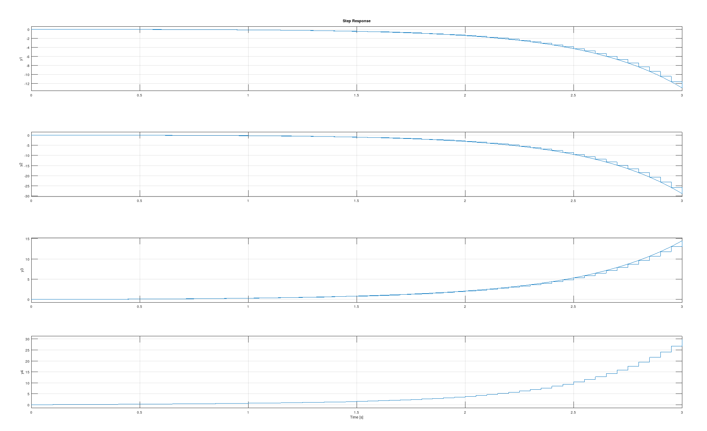

# About This Project
Control systems form the basis for ensuring that every automatic system performs its ordained task accurately, efficiently and quickly (optimally) despite being subjected to varying environmental conditions.

In this project, we explore one of these control systems, i.e., **[LQR (Linear Quadratic Regulator)](../Notes/Vedant/Control_Bootcamp_Vedant.md) Controller**, which is a type of controller in which we try to minimise a cost function by optimising the various factors involved in the physical system. Then, we apply LQR to the classical problem of an **Inverted Pendulum on Rails**, which is used as a benchmark for testing control strategies, both in simulation and hardware.

 

### 1. Research Topics
* **Linear Algebra**, for representation of various aspects of physical systems, like, current state, stability, etc.. ([Notes for the same](./Notes/Mahesh/LA_Notes_Mahesh.md))
* A thorough understanding of **Control Systems**. ([Notes for the same](./Notes/Mahesh/ControlBootcamp_Notes_Mahesh.md))

### 2. List of Software Used
* [GNU Octave, version 7.1.0](https://octave.org/) for modelling and simulation of inverted pendulum. 
* [SOLIDWORKS](https://www.solidworks.com/), for designing custom components.
* Embedded C

### 3. List of Hardware Used
* NEMA-17 Stepper Motor ([Notes for the same](./Notes/Mahesh/Controlling_Stepper_Motor.md))
* DRV8825 Motor Driver
* Rails, on which the cart moves
* Timing belt
* Custom-designed laser-cut cart, made of acrylic, and has screw-holes for the wheels (bearings) ([Drawing file for the plates](./Cart_design/side_plate.pdf))
* [ESP32 microcontroller](https://docs.espressif.com/projects/esp-idf/en/latest/esp32/)
* MPU6050, the IMU used for measuring the deviation of the pendulum from the normal
* 9 bearings
  * 8 in the cart (acting as wheels)
  * 1 inserted in the pendulum 
* Pendulum rod, having comparable weight to the cart

## Modelling the system in Octave
We first model the physical system by considering it's parameters (like mass of cart, pendulum rod, length of rod, etc.) and the dynamics equations. Then, we [linearise the system](https://github.com/vrnimje/Inverted-LQR-Bot-Eklavya/blob/develop/Notes/Mahesh/ControlBootcamp_Notes_Mahesh.md#linearizing-around-a-fixed-point) about it's equilibrium point, $\(pi, 0)$. Then, we represent the system as: 
$$\dot{x} = Ax + Bu$$ 
where 'u' is our input to the system. 

For the linearised system, we then define the system using the 'ss()' function. Using the 'c2d()' function, we [discretise the system](https://github.com/vrnimje/Inverted-LQR-Bot-Eklavya/blob/develop/Notes/Vedant/Control_Bootcamp_Vedant.md#3-linearising-around-a-fixed-point), and then we get the feedback matrix K, by using the function 'dlqr()'. [Octave File for reference](./Octave_Tasks/Vedant_Task_1/Inverted_Pendulum.m) 

The input,
$$u = -Kx$$
is then applied to the system, so as to minimise the LQR Cost function. The output is: 

Using the 'step()' function, this is the plot generated for the step response of the linearised system in terms of the state variables, i.e., 
$[\theta, \dot{\theta}, x, \dot{x}]$ with respect to time.

## Implementation of Inverted Pendulum in Hardware
First, we used the rails which were part of a CNC machine, and were firmly held in place. Then, the cart, fitted with the bearings, is then places around the rails. The stepper motor and the free pulley are mounted below the rails, and both of which drive a timing belt, which itself drives the cart. 

[These](./hardware_issues.md) are some of the issues we faced during the setup and testing process of the system, along with their solutions.

## Contributors
* [Vedant Nimje](https://github.com/vrnimje)
* [Mahesh Tupe](https://github.com/Asc91)

## Acknowledgements and Resources
* [SRA VJTI](https://github.com/SRA-VJTI)
* Special Thanks to our mentors [Jash Shah](https://github.com/Jash-Shah), [Ayush Kaura](https://github.com/Ayush-Kaura) and [Chinmay Lonkar](https://github.com/ChinmayLonkar)
* [Linear Algebra playlist by 3Blue1Brown](https://www.youtube.com/playlist?list=PL0-GT3co4r2y2YErbmuJw2L5tW4Ew2O5B)
* [Control Bootcamp playlist by Steve Brunton](https://www.youtube.com/playlist?list=PLMrJAkhIeNNR20Mz-VpzgfQs5zrYi085m)
* https://docs.espressif.com/projects/esp-idf/en/latest/esp32/
* https://newscrewdriver.com/2021/02/25/esp32-exercise-stepper-motor-pulses-with-ledc-pwm/

